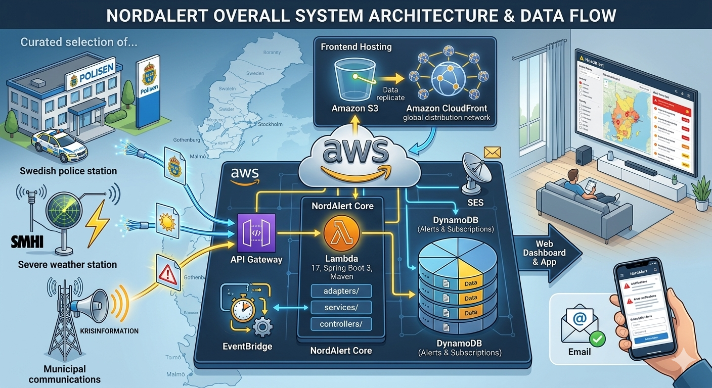
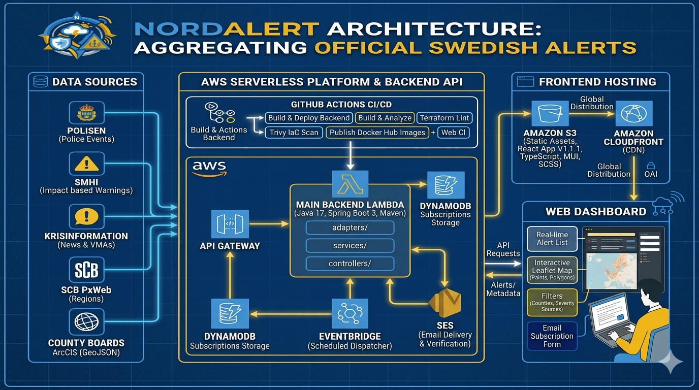

# AWS Serverless In Practice: Building NordAlert with Lambda, API Gateway, DynamoDB, SES, EventBridge, S3, and CloudFront

## Links

- GitHub repository: https://github.com/hashan-silva/nord-alert
- Web dashboard: https://d233b3o4qrwfy2.cloudfront.net/
- Backend API and docs: https://lbs3fr6lj6.execute-api.eu-north-1.amazonaws.com

Modern systems do not always need fleets of servers, long-running containers, or heavy platform management. For many real-world products, a serverless architecture gives a cleaner operational model: fewer moving parts to maintain, faster delivery, and infrastructure that scales with usage.

I applied that approach in **NordAlert**, a practical alert aggregation platform that brings together official Swedish public alerts from sources such as **Polisen**, **SMHI**, and **Krisinformation**. The goal was straightforward: provide a fast web dashboard, map-based alert visibility, filtering by county and severity, and email subscriptions for users who want alerts delivered automatically.

What makes NordAlert interesting is not just the product itself, but how naturally it maps to **AWS serverless components**.

## Why Serverless Fit NordAlert

NordAlert has a very typical pattern for public information systems:

- users consume alert data through a web UI
- the backend aggregates external APIs
- traffic can vary significantly
- most operations are event-driven, not continuously active
- email delivery happens on schedules, not in tight synchronous request paths

That is exactly where serverless becomes practical.

Instead of managing EC2, container clusters, or custom scaling logic, the system is broken into managed AWS services that each solve a narrow problem well.

## The Core AWS Serverless Components

### 1. AWS Lambda

At the center of NordAlert is **AWS Lambda**.

The backend is a Java Spring Boot application packaged for Lambda. It handles:

- `/alerts` for aggregated alerts
- `/counties` for official county metadata
- `/subscriptions` for email subscription creation and listing

Lambda is a strong fit here because the backend is request-driven. It does not need to run continuously. It only needs compute when:

- a user calls the API
- a scheduled task dispatches subscription emails

This keeps the runtime model simple:

- no server patching
- no instance sizing exercises
- no idle compute cost for quiet periods

### 2. Amazon API Gateway

**API Gateway HTTP API** sits in front of the backend Lambda.

It provides:

- public HTTPS entrypoint
- routing into Lambda
- CORS handling for the frontend
- a clean interface for the React application

For NordAlert, API Gateway is the boundary between the web app and the backend services. The frontend only needs a stable API URL; it does not care how the compute is hosted underneath.

This decoupling is one of the most practical benefits of serverless design.

### 3. Amazon S3

The frontend is a static React application. That makes **Amazon S3** an obvious hosting layer.

S3 stores:

- built web assets
- versioned frontend deployments

This removes the need for a web server tier just to serve static files.

### 4. Amazon CloudFront

**CloudFront** sits in front of S3 and serves the web dashboard globally.

It gives NordAlert:

- fast asset delivery
- HTTPS by default
- edge caching
- clean distribution of the frontend to end users

For a public dashboard, this matters. The backend can stay serverless, and the frontend can still feel responsive worldwide.

### 5. Amazon DynamoDB

For subscriptions, NordAlert uses **DynamoDB**.

It stores:

- subscriber email
- selected counties
- selected alert sources
- severity threshold
- subscription status such as `pending` or `confirmed`
- timestamps like creation and last notification

DynamoDB works well here because the subscription model is simple and access patterns are predictable:

- write new subscriptions
- list subscriptions
- update status
- update notification timestamps

There is no need for relational joins or complex transactional workflows.

### 6. Amazon SES

**Amazon SES** handles email-related workflows.

In NordAlert, SES is used for:

- sender identity management
- recipient verification
- outbound alert delivery

A practical example is the opt-in subscription flow:

- a subscription is created as `pending`
- SES starts recipient identity verification
- once the email address is verified, the subscription becomes eligible for alert delivery
- alert emails are then sent through SES

This is where serverless architecture becomes more than “hosting without servers.” It becomes workflow composition using managed services.

### 7. Amazon EventBridge

**EventBridge** drives the scheduled email dispatch flow.

NordAlert does not send alert emails directly when a subscription is created. Instead:

- EventBridge runs on a schedule
- it triggers a dedicated Lambda dispatcher
- that dispatcher checks confirmed subscriptions
- it filters newly matching alerts
- it sends the email through SES

This is a strong pattern:

- API requests stay fast
- scheduled processing is isolated
- email delivery is handled asynchronously
- the system remains simple to reason about

## Practical NordAlert Flow

Here is the end-to-end architecture in practical terms.

### Alert consumption flow

1. A user opens the NordAlert web dashboard.
2. CloudFront serves the static React app from S3.
3. The frontend calls API Gateway.
4. API Gateway invokes the backend Lambda.
5. The backend fetches and normalizes data from:
   - Polisen
   - SMHI
   - Krisinformation
   - SCB for county metadata
6. The frontend renders alerts as:
   - list view
   - map view with markers and polygons
   - filterable county/severity/resource views

### Subscription flow

1. A user opens the subscription dialog in NordAlert.
2. The frontend posts the subscription request to the backend.
3. The backend stores the subscription in DynamoDB as `pending`.
4. The backend asks SES to create or track the recipient email identity.
5. SES sends the verification email.
6. After verification, the subscription becomes `confirmed`.
7. EventBridge later triggers the dispatcher Lambda.
8. The dispatcher loads subscriptions from DynamoDB.
9. It filters new alerts by:
   - counties
   - severity
   - source
10. SES sends matching alert emails.

This is a practical serverless pipeline, not just a theoretical diagram.

## Why This Architecture Works Well

A few benefits became very clear in practice.

### Operational simplicity

Each AWS service owns one concern:

- Lambda for compute
- API Gateway for HTTP entry
- S3/CloudFront for frontend delivery
- DynamoDB for subscription state
- SES for email
- EventBridge for scheduling

That separation reduces infrastructure complexity.

### Cost alignment

NordAlert’s workload is event-driven:

- API calls happen only when users access the dashboard
- scheduled dispatch runs only at intervals
- static frontend hosting is cheap and cacheable

This fits serverless economics well.

### Scaling without orchestration burden

Public alert systems can be quiet most of the time and spike during incidents. Serverless components absorb that pattern naturally without manual scaling operations.

### Faster product iteration

Because the infrastructure is narrow and managed, the focus stays on product behavior:

- alert normalization
- map rendering
- filtering logic
- subscription workflows

That is where engineering effort should go.

## Practical Lessons

A few lessons from NordAlert are worth calling out.

### Serverless still needs architecture discipline

Using managed services does not remove design decisions. You still need:

- clean backend boundaries
- explicit data models
- controlled async workflows
- careful IAM permissions

### Event-driven workflows should stay explicit

Email dispatch was better as:

- DynamoDB state
- EventBridge schedule
- dedicated Lambda handler
- SES delivery

than as something mixed directly into the request path.

### Static frontends pair extremely well with serverless APIs

React + S3 + CloudFront + API Gateway + Lambda is still one of the most practical deployment models for dashboard-style products.

## Closing

NordAlert is a good example of where AWS serverless is not just fashionable, but genuinely useful.

The system needs:

- public HTTP APIs
- scheduled processing
- email delivery
- lightweight persistence
- static frontend hosting
- scalable execution with minimal operations overhead

AWS Lambda, API Gateway, DynamoDB, SES, EventBridge, S3, and CloudFront fit those needs directly.

That is the real value of serverless architecture: not avoiding servers for the sake of it, but assembling the right managed components so the product stays simpler to build, run, and evolve.
